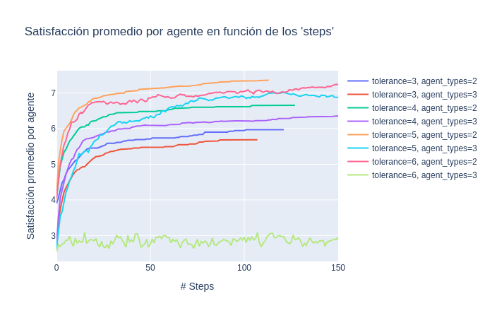
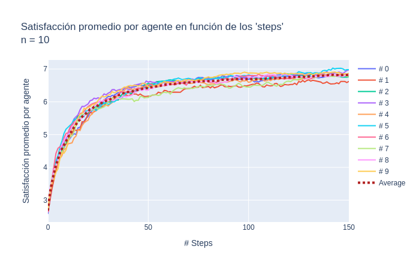
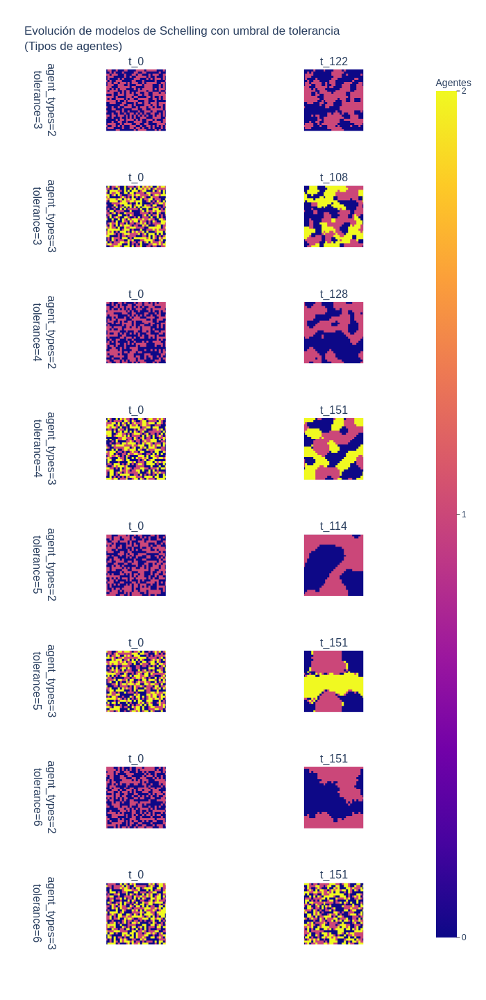
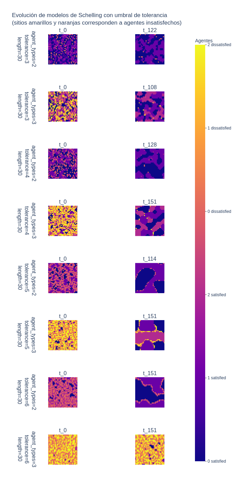
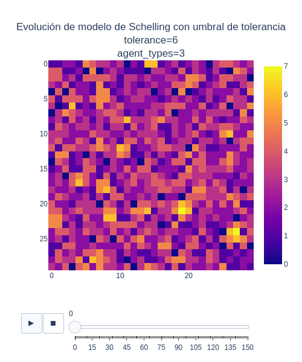

# Simulation

In this section we will see the different components that allow us to execute the built-in models and simulate certain experiments.

* [Parameters](#parameters)
* [Runner](#runner)
* [Plotter](#plotters)
    * [Numerical series](#numerical-series)
    * [Final grid](#final-grid)
    * [Animated lattice](#animated-lattice)

---

## Parameters

As we have seen, the models have multiple parameters, own or inherited from the abstract model, which would be interesting to analyze with a set of possible values ​​and their different combinations.

To achieve this, there is the `ExperimentParametersSet` class. This class allows you to collect the different values ​​to analyze for each of the attributes of interest. Any attribute of `keyword` format can be passed to it, therefore we must know what parameters the model we will use expects and use exactly the same names.

For example, we know that the abstract model accepts the `length` and `neighborhood` parameters, and if we are specifically using the `GameOfLife` model, we can also pass it a list of *seeds* or *patterns*, so a possible set of parameters to simulate would be the following:

```python
from simulab.simulation.core.experiment import ExperimentParametersSet
from simulab.simulation.core.neighborhood import Moore

seeds = [Blinker(25,25), Blinker(28,28), Glider(10,10)]
experiment_parameters_set = ExperimentParametersSet(
    length=[50, 60, 70],
    neighborhood=[Moore],
    seeds=[seeds],
)
```

Internally, the Cartesian product will be applied to the different parameter lists, generating a parameter set where each element will be a parameter configuration for a given instance. Since in the example we have 3 parameters where one has 3 possible values ​​and both remaining have a single possible value, the cardinal of the resulting set will be $3 \times 1 \times 1 = 3$. Something like the following:

```json
[
    {
        'length': 50,
        'neighborhood': Moore,
        'seeds': seeds,
    },
    {
        'length': 60,
        'neighborhood': Moore,
        'seeds': seeds,
    },
    {
        'length': 70,
        'neighborhood': Moore,
        'seeds': seeds,
    },
]
```

Note that in the possible parameter values, in principle any quantity can be entered. That is, an analysis can be done on multiple parameters simultaneously. The complexity of the final analysis will depend on the selection of these values, but the system does not impose any limit in this regard. In the following example we have a cardinality of $3 \times 2 \times 3 = 18$:

```python
from simulab.simulation.core.experiment import ExperimentParametersSet
from simulab.simulation.core.neighborhood import Moore, VonNeumann

seeds=[
    [Block(1,1), BeeHive(1,44), Loaf(23,23), Boat(44,1), Tub(44,44)],
    [Blinker(2,2), Toad(2,44), Beacon(44,2), Pulsar(19,19), Pentadecathlon(35,35)],
    [Glider(25, 25), LightWeightSpaceship(2,2), MiddleWeightSpaceship(1,20), HeavyWeightSpaceship(1,40)],
]
experiment_parameters_set = ExperimentParametersSet(
    length=[50, 60, 70],
    neighborhood=[Moore, VonNeumann],
    seeds=seeds,
)
```

> [!IMPORTANT]
> Since all attributes of the `ExperimentParametersSet` class must be lists, if a particular parameter is already of type `List` (as is the case with `seeds`), note that a list of lists must be passed.

## Runner

To execute the simulation there is the `Runner` object, which knows the protocol of the abstract model so that it can be executed without us worrying about its implementation. Therefore, with the `experiment_parameters_set` above, we could do something like the following:

```python
from simulab.simulation.core.runner import Runner
from simulab.simulation.core.equilibrium_criterion import WithoutCriterion
from simulab.models.computational.game_of_life.model import GameOfLife

runner = Runner(
    model=GameOfLife,
    experiment_parameters_set=experiment_parameters_set,
    equilibrium_criterion=WithoutCriterion(),
    max_steps=50,
)

runner.start()
```

In this example there is no balance criterion, so the simulation will inevitably run up to the maximum iteration indicated. But different balance criteria can be implemented and used in `Runner` instances. For this there is the `AbstractCriterion` class that defines an interface that all criteria should implement:

```python
class AbstractCriterion(ABC):
    @abstractmethod
    def in_equilibrium(self, series: Dict[str, Any]) -> bool:
        pass
```

In particular, a more interesting criterion is already provided (in addition to the one seen above, the trivial and innocuous `WithoutCriterion`).

```python
from simulab.simulation.core.equilibrium_criterion import EquilibriumCriterion

criterion = EquilibriumCriterion(
    series_name="total_average_satisfaction_level",
    window_size=20,
    tolerance=0.001,
)
```

This criterion (used, for example, in conjunction with the Schelling model) will allow the `Runner` instance to observe the evolution of the series called `total_average_satisfaction_level`, take a past time window of 20 iterations and decide whether, during that window, the total values ​​of the series remained within the tolerance value. If so, the `in_equilibrium` method of this criterion will return `True` and will trigger the *runner* to stop the simulation even if it has not reached the maximum iteration.

The `Runner` class has one last interesting attribute that allows us to repeat the same experiment multiple times, to find trends, calculate averages, etc. This is the `repeat` parameter, which receives an instance of the `Execute` class.

> [!WARNING]
> For simplicity, it is decided that this *feature* only works in conjunction with instances of `ExperimentParametersSet` that generate sets of cardinality 1, that is, with a single experiment instance. Later, if useful, this could be done for any possible `ExperimentParametersSet` instance.

For example, in the case of a Schelling model it could be interesting to carry out 10 simulations with the same parameters, obtain the 10 series that report the evolution of the average satisfaction in each experiment and calculate the average of them. To do this we could do something like:

```python
from simulab.simulation.core.runner import Runner, Execute

runner = Runner(
    Schelling,
    experiment_parameters_set,
    criterion,
    max_steps=150,
    repeat=Execute("total_average_satisfaction_level", times=10),
)
```

If it is necessary to save the history of more than one series across multiple repetitions of the experiment, several series names can be passed to the `Execute` class, all as parameters in positional format, before the *keyword* `times` parameter. (whose default value is 1).

## Plotters

Finally, there are 3 objects that plot the results. They all understand the `show_up` class method.

> [!IMPORTANT]
> *Plotters* use the Plotly library to show the different results.

### Numerical series

To plot time series with numerical values ​​you can use the `NumericalSeries` class. The main parameters are the name of the series to be plotted, the *runner* instance that contains the data, the title of the graph, its size, the labels of the axes and whether they should be displayed logarithmically. For example, again with the Schelling case:

```python
from simulab.simulation.plotters.numerical_series import NumericalSeries

NumericalSeries.show_up(
    "total_average_satisfaction_level",
    runner=runner,
    plot_title="Satisfacción promedio por agente en función de los 'steps'",
    yaxis_title="Satisfacción promedio por agente",
)
```



*Plotter* will automatically generate the legends for each series based on the parameters used. Given that the most natural thing would be not to scan too many parameters at once, as this would make the final analysis very complex, automatic legends should not generate names that are too long and complex.

Something interesting to mention is that if the *runner* instance provided had a *repeat* greater than 1 (therefore it is a set of several experiments but not with different sets of parameters, but with the same one), the *plotter* will automatically consider that the requested series are comparable and will calculate the average between them, without having to pass any extra parameters.



> [!NOTE]
> Perhaps later other interesting functionalities can be added beyond just calculating the average.

### Final grid

If you want to observe a two-dimensional series over a set of simulations with different combinations of parameters, the *plotter* to use is `FinalGridSeries`. Its parameters are the name of the series to be plotted, the *runner* instance with the simulated results, the graph title, the legend, the diagram size, etc.

```python
from simulab.simulation.plotters.final_grid import FinalGridSeries

FinalGridSeries.show_up(
    "agent_types_lattice",
    runner=runner,
    plot_title=("Evolución de modelos de Schelling con umbral de tolerancia <br>"
                "(Tipos de agentes)"),
    leyend="Agentes",
)
```



This *plotter* has another attribute called `attributes_to_consider`. This is because as mentioned, plotters automatically generate an identifier for each experiment based on the combination of its parameters. But the parameters used for these identifiers are only the ones that vary.

If a parameter was the same for all experiments, it will not appear in the experiment identifier and therefore will not appear in the legends of the resulting plot. This attribute then allows us to add other parameters that we want to be shown in the legends, regardless of whether they have been part of the parameter analysis or not. If a parameter is indicated in this attribute that is already considered by the *plotter* by default, it is considered only once (for example the `tolerance` attribute in the *snippet* below, was already considered because the runner has experiments that vary this attribute):

```python
from simulab.simulation.plotters.final_grid import FinalGridSeries

FinalGridSeries.show_up(
    "dissatisfaction_threshold_lattice",
    runner=runner,
    plot_title=("Evolución de modelos de Schelling con umbral de tolerancia <br>"
                "(sitios amarillos y naranjas corresponden a agentes insatisfechos)"),
    leyend="Agentes",
    attributes_to_consider=["length", "tolerance"],
)
```



> [!TIP]
> For clarification: each row of the diagram is an experiment simulated by the *runner*. The initial and final configuration are displayed. To the left of each row the aforementioned identifier is displayed, corresponding to the parameters used in each experiment. Above each configuration the iteration in which it was taken is shown, in t_i format.

### Animated lattice

If you want to observe the evolution step by step (and not just the initial and final configuration), you should use `AnimatedLatticeSeries`, whose attributes are the name of the series, the *runner* instance, the experiment number to plot ( in base 0), the title of the graph, the dimensions, the playback speed (value between 0 and 1) and again, the aforementioned `attributes_to_consider` with the same logic.

```python
from simulab.simulation.plotters.animated_lattice import AnimatedLatticeSeries

AnimatedLatticeSeries.show_up(
    "satisfaction_level_lattice",
    runner=runner,
    experiment_id=7,
    plot_title="Evolución de modelo de Schelling con umbral de tolerancia",
    height=600,
    width=500
)
```



> [Back](../README.md)
